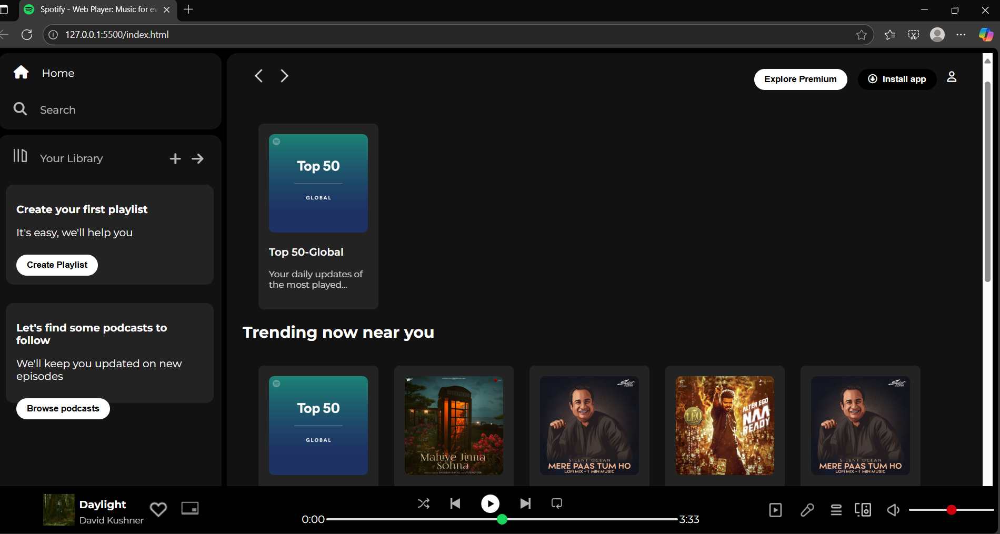

## 🎧 Spotify UI Clone ##

 A responsive front-end clone of the Spotify web player built using HTML, and vanilla CSS. 
  This project focuses purely on the UI/UX design — no backend or music functionality included. 

  ---

## Preview ##

---

## Features ## 
- Respoinsive layouts
- Transition effects
- Clean and Scalable code structure
- And many more coming soon...

  ---

## Show Your Support ##
- Feel free to [reach out]("shreelaxmihegde9@gmail.com") with any feedback — it's always appreciated!
- Interested in collaborating on this project? I'd love to [connect]("github.com/ShreelaxmiHegde")!
- If you like this project, drop a ⭐ on the repo — it helps a lot!
